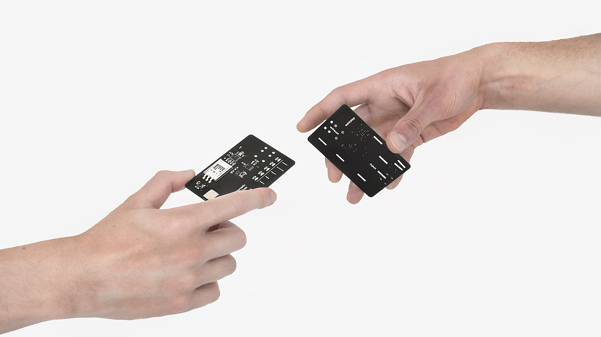

# The rhizomatic sublime
### Searching for aesthetic transcendence in digital transience
Process and documentation of a research by [Max Wolfs](https://github.com/maxwolfs) and [Alexander Lehmann](https://github.com/bsplt).

### Rhizm

We object to the mundane paradigm of Human-Computer-Interaction and demand a Human-Human-Interaction. It's pyhsicial, it's intimate, it's exciting. Rhizm is a device in the shape of a credit card that connects over a satisfying magnetic click. Caution: Hands may touch. The connection of two cards creates a new bond in a decentralized social mesh network. Combined with a web interface that shows the verified encrypted interactions, Rhizm can be used for many different scenarios in which a physicial interaction between nodes must be safe. Or appealing. We understand our project as fundamental research in times of disbelief and scepsis among the realms of new technologies and social media. We want to commit ourselves to the power of open source platforms. Through social sandboxes like Rhizm a diverse variety of use cases such as self deployable social networks depending on real human interactions are possible.

Inject - Exhaust - Dissipate