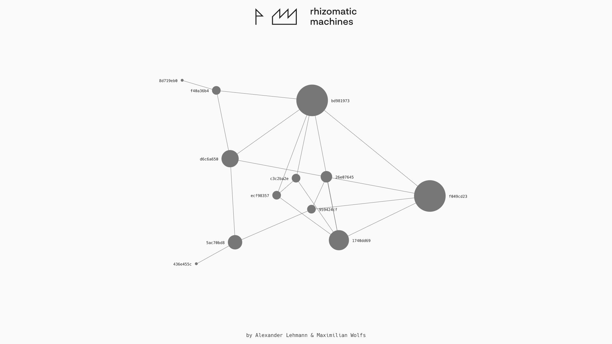

# Application for HEC Sponsorship 2018

# Rhizomatic Machines

Wir haben eine neue Interaktion erfunden.

## Hintergrund

Der aktuelle Trend von digitalen Services von Shopping über soziale Netzwerke bis hin zu zivilen Institutionen besteht darin, die Dienstleistungen in Apps und Webseiten über General Purpose Devices allen voran Smartphones anzubieten. Dieses Paradigma trifft die Annahme, dass ein Interface - in diesem Falle der Touchscreen - das beste Lösung zu sein scheint. In unseren Augen ist diese jedoch nur der kleinste gemeinsame Nenner.

Wie kann man Cloud Technologien und Digital Services bedeutungsvoll in den Alltag implementieren? Wir sind dabei auf der Suche nach einer Lösung dafür im Bereich UI und UX zu finden. Gerade sind wir dabei ein IoT Wearable zu entwickeln das als Brücke zwischen barem Metall und der Cloud gilt. 

## Konzept

von UX bis Security.
Sandbox, Social Meshnetwork, Blockchain, WiFi, Secure&Encrypted, open api

Wir betrachten das Projekt als experimentelle Grundlagenforschung mit der hautpsächlichen Fragestellung:
Wie kann man dise Technologien in einen sinnvolleren und vor allem bedeutungsvolleren Kontext in unseren Alltag implementieren?

## Stand der Dinge

Wir haben einen Prototypen bestehend aus Karte mit PCB, Web Interface, Datenvisualisierung und Datenbank. Maßgeblich bestimmend für den aktuellen Zwischenstand des Projekts war eine medienkünstlerische sowie Designperspektive auf eine neue Interaktion die als Brücke zwischen physischen und Cloud darstellt. Der eigens entworfene Schaltkreis und das Layout nehmen das Medium der Platine nicht als bloßen Träger von Elektronikbauteilen, sondern als ästhetisches Objekt wahr. Durch diese bedeutungsvolle Aufwertung und unserer entwickelten Interaktion zweier Karten mittels selbst entwickelten Magnetkontakten entsteht darüberhinaus eine neue User Experience von Bedeutung.

Jede Karte hat eine einzigartige ID. Werden zwei Karten an ihren Magnetkontakten verbunden, wecken sie sich gegenseitig aus dem Deep Sleep Modus auf und tauschen via Serial Interface ihre IDs aus. Damit ist das Potential des Superkondensators, welcher als Stromquelle dient erschöpft. Wird die Karte das nächste Mal via USB-C aufgeladen, sendet sie automatisch via integriertem WiFi die vorher getätige Verbindung an die API. Haben dies beide Karten getan, werden die Pairinganfragen in der Datenbank als verifiziert gesetzt. Eine Visualisierung aller verifizierten Kartenpairings ist auf der Hauptseite http://www.rhizomaticmachines.com zu sehen.

Jede Karte stellt dabei einen Punkt dar. Je größer die Punkte desto mehr verifizierte Pairings hat die Karte zu verzeichnen. Zu sehen ist also eine relationale Karte aller gerade bestehenden Prototypen. Ein Mesh sozialer Interaktionen.

## Ziel

Mithilfe des HEC Sponsorships wollen wir die Möglichkeit bekommen das Projekt an einer Testgruppe zu evaluieren. Dies würden wir gerne zusammen mit HEC als Tech Insider eruieren. Ohne die Förderung ist dies mit den bisherigen finanziellen Aufwendungen nicht möglich.

## Budget

Position | Betrag
--- | ---
PCBs | 300€
Komponenten |  800€
Werkzeuge | 200€
Hosting/Server | 200€
**Summe** |	**1500€**

## Roadmap

Zeitraum | ToDo
--- | ---
Mai | Grundlagenforschung, Realigning, Verständnis der Technologien vertiefen
Juni - Juli | Redesign
Juli - August | Test Phase and Evaluation
September | Evaluation

## Fotos

