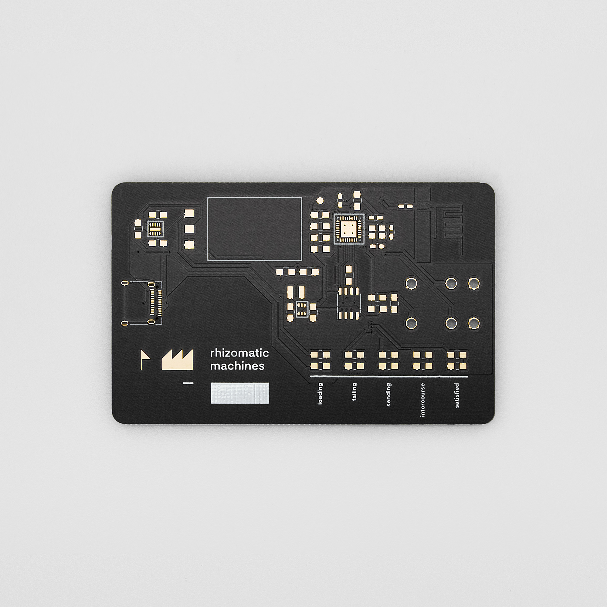
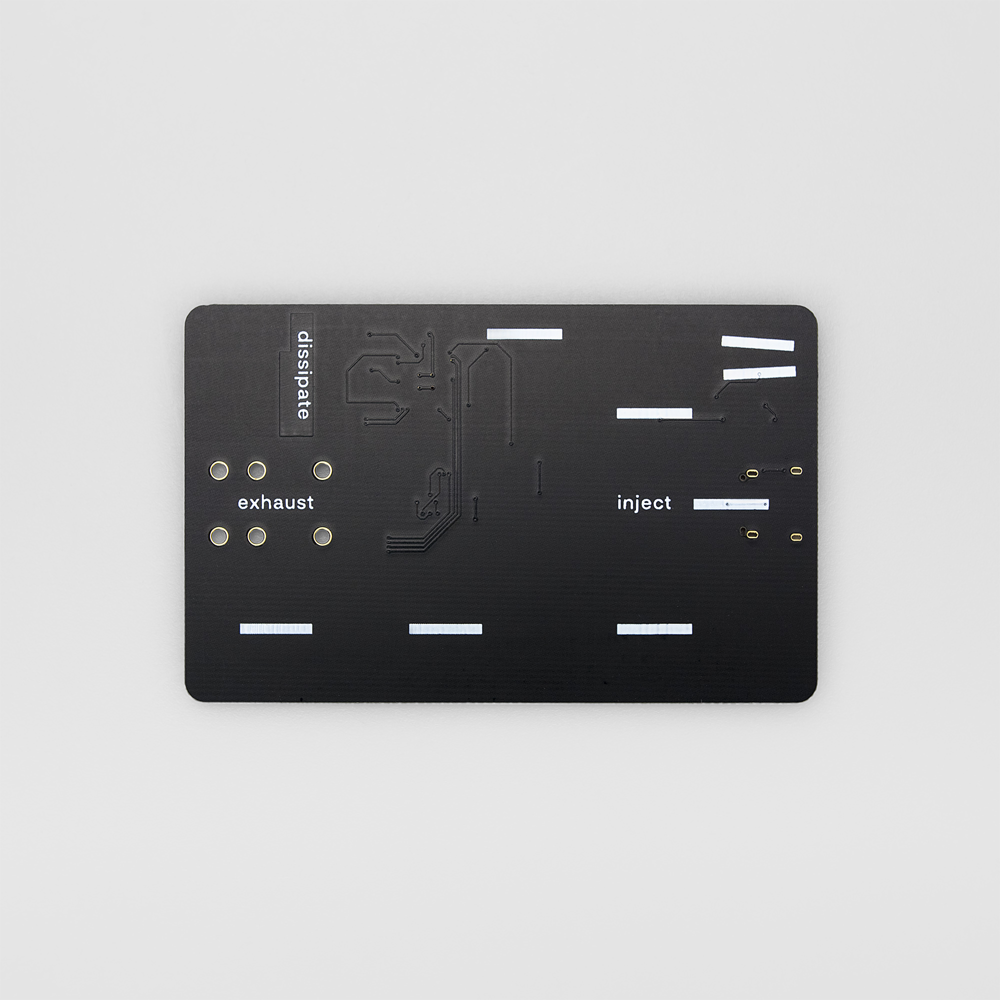
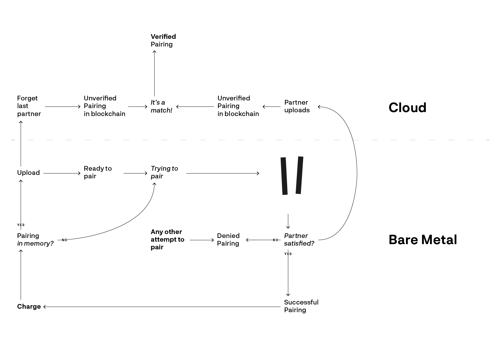
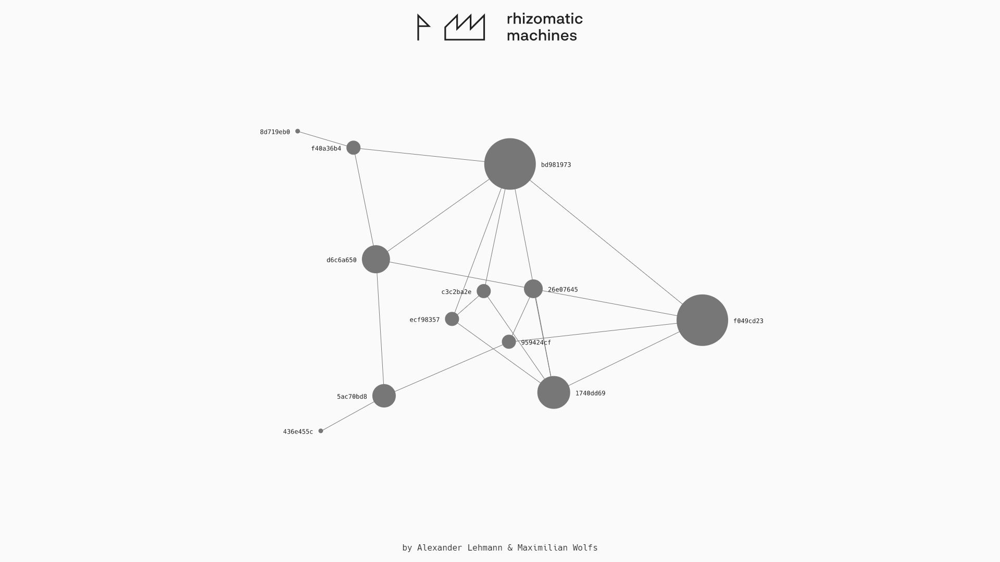

# DM website documentation of rhizomatic machines by Alexander Lehmann & Maximilian Wolfs

* Title: Rhizomatic Machines
* Category: Semesterarbeit
* Student/s: Maximilian Wolfs, Alexander Lehmann
* Course Title: Master Project
* Lecturer/s: Ralf Baecker, Dennis Paul
* Year: WS 2017/18

Wir haben eine neue Interaktion erfunden.

Der aktuelle Trend digitaler Services von Shopping über soziale Netzwerke bis hin zu zivilen Institutionen besteht darin, die Dienstleistungen in Apps und Webseiten über General Purpose Devices allen voran Smartphones anzubieten. Dieses Paradigma trifft die Annahme, dass ein Interface - in diesem Falle der Touchscreen - das beste Lösung zu sein scheint. In unseren Augen ist dieser jedoch nur der kleinste gemeinsame Nenner.

Wie kann man Cloud Technologien und Digital Services bedeutungsvoll in den Alltag implementieren? Wir sind dabei auf der Suche nach einer besseren Lösung, die wir im Bereich UI und UX finden wollen. Unser Ansatz: Wir entwickeln ein sicheres IoT Wearable, das als Brücke zwischen barem Metall und der Cloud fungiert.

Wir sehen in unserem Produkt eine soziale Sandbox, die ganzheitlich von Cryptography bis UX Design gedacht ist. Das Projekt an sich stellt in seiner Schnittmenge experimentelle Grundlagenforschung dar. Wir untersuchen Felder wie Interaction Design, Blockchain und IoT und fragen uns, wie man diese Technologien in einem sinnvolleren und vor allem bedeutungsvolleren Kontext in unserem Alltag implementieren kann. Im gegenwärtigen Konzept beschäftigen wir uns mit der Machbarkeit eines solchen Services und wollen die Möglichkeiten der Sandbox mit diversen Szenarien eruieren. So können wir uns beispielsweise Anwendungen wie ein soziales Netzwerk beruhend auf physischer Interaktion vorstellen.

Der aktuelle Prototyp besteht aus Karten/PCBs und einem Web Interface mit Datenvisualisierung und Datenbank. Eine Interaktion der Karten erzeugt einen Eintrag in der Cloud, der sich in einem Graphen manifestiert. Maßgeblich bestimmend für den aktuellen Zwischenstand des Projekts war eine medienkünstlerische sowie gestalterische Perspektive auf eine neue Interaktion, die eine Brücke zwischen physischer Realität und Cloud bildet. Der eigens entworfene Schaltkreis und das Layout nutzen das Medium der Platine nicht als bloßen Träger von Elektronikbauteilen, sondern formen aus ihm ein ästhetisches Artefakt. Durch diese bedeutungsvolle Aufwertung und unserer entwickelten Interaktion zweier Karten mittels selbst entwickelten Magnetkontakten entsteht darüberhinaus eine neue User Experience von Bedeutung.

Jede Karte hat eine einzigartige ID. Werden zwei Karten an ihren Magnetkontakten verbunden, wecken sie sich gegenseitig aus dem Tiefschlaf auf und tauschen über die Schnittstelle ihre IDs aus. Ein nachhaltiger Superkondensator versorgt diesen Vorgang mit Strom. Wird die Karte das nächste Mal via USB-C aufgeladen, sendet sie automatisch mit Hilfe ihrer integrierten WiFi-Funktionalität die vorher getätige Verbindung an die API. Haben dies beide Karten getan, werden die Pairing-Anfragen in der Datenbank als verifiziert gesetzt. Eine Visualisierung aller verifizierten Kartenpairings ist auf der Hauptseite http://www.rhizomaticmachines.com zu sehen.

Im grafischen Interface wird jede Karte durch einen Kreis mit relationalen Verbindungen dargestellt. Je größer die Punkte, desto mehr verifizierte Pairings hat die Karte zu verzeichnen. Zu sehen ist also eine Karte aller gerade bestehenden Prototypen und ihrer Pairing-Aktivitäten. Ein Mesh sozialer Interaktionen.
