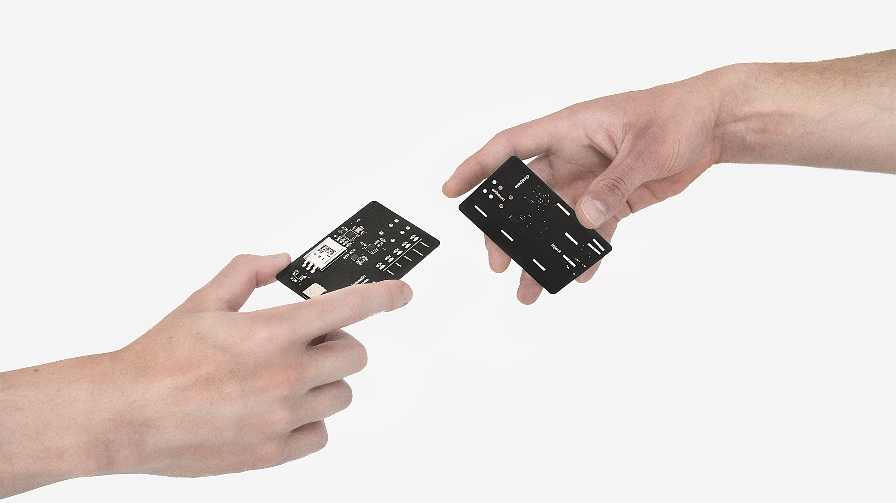
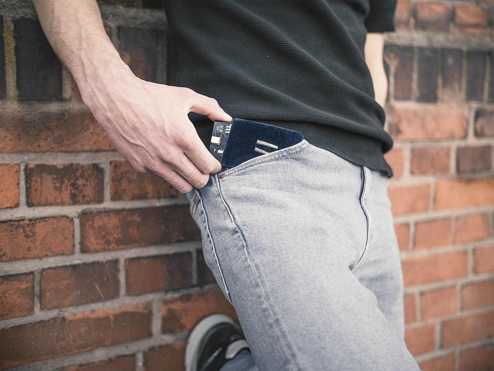
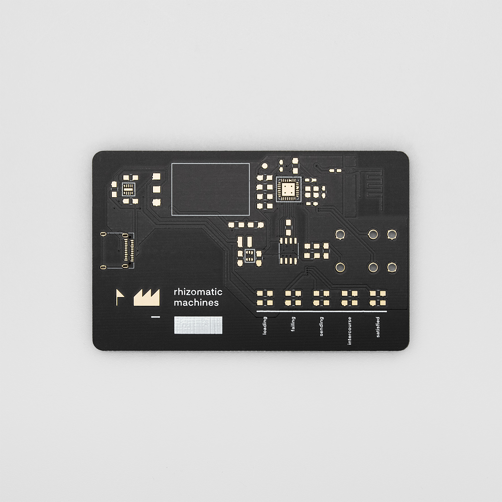
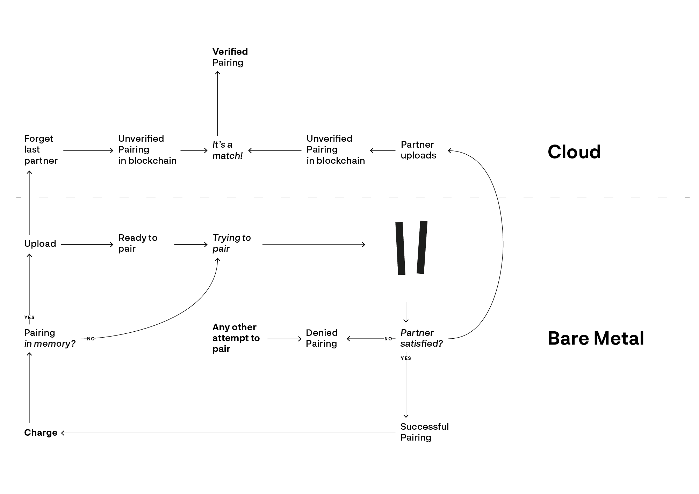

# DM website documentation of rhizomatic machines by Alexander Lehmann & Maximilian Wolfs

* Title: Rhizomatic Machines
* Category: Semesterarbeit
* Student/s: Maximilian Wolfs, Alexander Lehmann
* Course Title: Master Project
* Lecturer/s: Ralf Baecker, Dennis Paul
* Year: WS 2017/18

We invented a new interaction.

The current trend in digital services, from shopping to social networking and civil institutions, is to offer services in apps and websites via general-purpose devices, especially smartphones. This paradigm makes the assumption that an interface - in this case the touch screen - seems to be the best solution. In our eyes, however, this is only the lowest common denominator.

How can you implement cloud technologies and digital services meaningfully into everyday life? We are looking for a better solution that we want to find in the area of ​​UI and UX. Our approach: We develop a secure IoT wearable that acts as a bridge between bare metal and the cloud.

We see in our product a social sandbox that is holistically conceived from cryptography to UX design. The project itself is an intersection of basic experimental research. We explore fields such as interaction design, blockchain, and IoT, and ask ourselves how to implement these technologies in a more meaningful and, above all, more meaningful context in our everyday lives. In the current concept, we are concerned with the feasibility of such a service and want to explore the possibilities of the sandbox with various scenarios. For example, we can think of applications like a social network based on physical interaction.

The current prototype consists of cards / PCBs and a web interface with data visualization and database. An interaction of the maps creates an entry in the cloud that manifests itself in a graph. The decisive factor for the current status quo of the project was a media-artistic and creative perspective on a new interaction, which forms a bridge between physical reality and the cloud. The specially designed circuit and layout do not use the board's medium as a mere carrier of electronic components, but shape it into an aesthetic artifact. This significant enhancement and our developed interaction of two cards using self-developed magnetic contacts also creates a new user experience of importance.

Each card has a unique ID. If two cards are connected to their magnetic contacts, they awaken each other from deep sleep and exchange their IDs via the interface. A sustainable supercapacitor supplies power to this process. The next time the card is charged via USB-C, it automatically sends the previous connection to the API using its built-in WiFi functionality. If both cards have done so, the pairing requests in the database will be set as verified. A visualization of all verified card pairings can be seen on the main page http://www.rhizomaticmachines.com.

In the graphical interface, each map is represented by a circle of relational connections. The larger the points, the more verified pairings the card has. You can see a map of all existing prototypes and their pairing activities. A mesh of social interactions.
